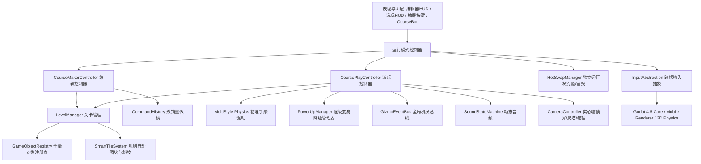

# Super Mario Maker Neo (SMMneo) - 工业级软件设计规格说明书 (SDD Specification)

> **规范版本**: 1.1.0-FINAL-APPROVED  
> **制定日期**: 2026-09-21  
> **设计方法论**: SDD (Spec-Driven Development / IEEE 1016 体系标准)  
> **目标平台**: Windows (x86_64), macOS (Universal), Linux (x86_64), Android (ARM64)  
> **基准引擎**: Godot Engine 4.6+ (Mobile 渲染器, Forward+ 兼容, 2D Jolt Physics)  

---

## 目录
1. [项目愿景与设计总则](#1-项目愿景与设计总则)
2. [全局架构与子系统拓扑](#2-全局架构与子系统拓扑)
3. [2D 物理碰撞分层与手感动力学规范](#3-2d-物理碰撞分层与手感动力学规范)
4. [核心对象模型与组件系统](#4-核心对象模型与组件系统)
5. [关卡数据契约与存储架构](#5-关卡数据契约与存储架构)
6. [关卡编辑器规格说明](#6-关卡编辑器规格说明)
7. [核心游戏玩法子系统](#7-核心游戏玩法子系统)
8. [全平台跨端输入与触控交互](#8-全平台跨端输入与触控交互)
9. [动态摄像机与卷轴控制系统](#9-动态摄像机与卷轴控制系统)
10. [全局机关与事件总线系统](#10-全局机关与事件总线系统)
11. [动态音频系统规格](#11-动态音频系统规格)
12. [智能 Tile 与场景主题管理](#12-智能-tile-与场景主题管理)
13. [资产隔离与本地解包管道](#13-资产隔离与本地解包管道)
14. [国际化与本地化规范](#14-国际化与本地化规范)
15. [工程目录拓扑与编码标准](#15-工程目录拓扑与编码标准)
16. [实施路线图与里程碑](#16-实施路线图与里程碑)

---

## 1. 项目愿景与设计总则

### 1.1 项目定位
SMMneo 是一个基于 Godot 4 引擎、面向全平台的《Super Mario Maker 2》(SMM2) 工业级完美复刻开源项目。
- **经典三风格优先**：优先完整打磨 **SMB1**、**SMB3**、**SMW** 三种核心风格，并在架构上对 **NSMBU** 与 **SM3DW** 做好无缝拓展设计。
- **双模核心支柱**：自由创作的关卡编辑器 (Course Maker) 与 100% 物理手感确定的关卡游玩引擎 (Course Play)。
- **全平台支持**：针对桌面 PC (Windows, macOS, Linux) 与 移动端 (Android) 提供双模原生级交互与界面适配。
- **严谨架构**：采用数据驱动 (Data-Driven) + 轻量组件化 (ECS-Lite)，保证可扩展性与代码可维护性。
- **版权合规**：核心仓库不含侵权素材，提供自动化本地解包与导入向导。

---

## 2. 全局架构与子系统拓扑



### 核心全局单例 (Autoload)
| 单例名称 | 脚本路径 | 核心职责 |
|---|---|---|
| `GameManager` | `res://src/autoload/game_manager.gd` | 负责游戏全局生命周期与模式调度 |
| `Registry` | `res://src/autoload/registry.gd` | 载入并暴露 `objects.json`，提供实体配置与变体查询 |
| `LevelManager` | `res://src/autoload/level_manager.gd` | 关卡数据内存持有者、JSON 序列化与文件存取 |
| `InputManager` | `res://src/autoload/input_manager.gd` | 聚合键盘、手柄与触控按键事件，派发统一语义动作 |
| `GizmoEventBus` | `res://src/autoload/gizmo_event_bus.gd` | 集中式机关事件总线 (ON/OFF, P-Switch, POW, 钥匙) |
| `AudioManager` | `res://src/autoload/audio_manager.gd` | AudioBus 管理与动态音乐状态机 |
| `CourseBot` | `res://src/autoload/course_bot.gd` | 机器鸽关卡仓储库，处理关卡卡片、截图与文件导出分享 |

---

## 3. 2D 物理碰撞分层与手感动力学规范

### 3.1 严格 7 层物理分层 (Physics Layers)
1. **Layer 1: Solids** — 地形实心方块、地面、硬块、管道外壁、激活状态的实体开关块。
2. **Layer 2: Player** — 马里奥主角。
3. **Layer 3: Enemies** — 栗子球、慢慢龟、吞食花、刺顶实体。
4. **Layer 4: Pickups** — 金币、超级蘑菇、火花、无敌星等道具。
5. **Layer 5: Projectiles** — 飞踢出的龟壳、火球、敌人炮弹、飞锤。
6. **Layer 6: Semisolids** — 单向板平台（自下而上跳穿、顶部站立）。
7. **Layer 7: Sensors** — 区域触发器（终点触发、钥匙门感应、管道入口、深渊销毁线）。

### 3.2 多风格物理参数矩阵 (PlayerPhysicsProfile)
三风格通过独立的 `PlayerPhysicsProfile` 资源文件进行配置：

| 物理常数 | SMB1 风格 | SMB3 风格 | SMW 风格 (优先打磨) |
|---|---|---|---|
| 行走最大速度 (Walk Max) | 78.0 px/s | 84.0 px/s | 78.0 px/s |
| 跑步最大速度 (Run Max) | 156.0 px/s | 168.0 px/s | 180.0 px/s |
| P-Meter 冲刺速度 | 不支持 | 204.0 px/s | 216.0 px/s |
| 地面加速度 (Ground Accel) | 220.0 px/s² | 240.0 px/s² | 200.0 px/s² |
| 滑行刹车阻尼 (Skid Decel) | 380.0 px/s² | 420.0 px/s² | 400.0 px/s² |
| 基础跳跃初速度 (Jump Initial) | -340.0 px/s | -350.0 px/s | -360.0 px/s |
| 极速大跳初速度 (Super Jump) | -380.0 px/s | -410.0 px/s | -430.0 px/s |
| 旋转跳初速度 (Spin Jump) | 不支持 | 不支持 | -280.0 px/s |
| 重力加速度 (Gravity) | 880.0 px/s² | 920.0 px/s² | 900.0 px/s² |
| 最大下落速度 (Max Fall) | 260.0 px/s | 270.0 px/s | 258.0 px/s |
| 空中机动率 (Air Control) | 极小惯性锁死 | 适中 | 优秀 (高自由度微调) |

### 3.3 平台手感五大核心算法
1. **变高跳跃截断 (Variable Jump Cut)**：上升期松开跳跃键，立即乘算 `velocity.y *= 0.55`。
2. **土狼时间 (Coyote Time)**：离地 6 物理帧内仍可起跳。
3. **跳跃输入缓冲 (Jump Buffering)**：落地前 5 物理帧按下跳跃键，着地自动起跳。
4. **拐角微调纠偏 (Corner Correction / Slip)**：头顶擦方块边角 1~3 像素时自动平移 1~3px 滑过。
5. **顶块法线检测与吸附**：撞击 Y > 0.5 时触发方块交互，并将垂直速度反向设为 +10px/s 避免黏连。

---

## 4. 核心对象模型与组件系统

### 4.1 数据驱动注册表 (`objects.json`)
全量对象必须在 `res://data/registry/objects.json` 注册，支持风格过滤、调色板分类与属性配置 Schema。

### 4.2 可复用组件集合
- `HitboxComponent (Area2D)`: 提供精准的头部受击、足底踩踏、侧面碰触回调。
- `BumpableComponent (Node)`: 赋予方块被顶起时的弹性缓动与上方实体推击。
- `ContainerComponent (Node)`: 管理方块内藏物品（金币、蘑菇）的弹出缓动与激活。
- `GravityMovementComponent (Node)`: 赋予敌人巡逻走动、撞墙调头与悬崖检测。
- `WingedComponent (Node)`: 为任意实体附加翅膀正弦波振翅悬浮与跳跃动力学。
- `ParachuteComponent (Node)`: 赋予实体降落伞低速降落并在触地时自动脱落。
- `ICarryable (接口)`: 声明被抓取、手持、踢出与高抛的行为契约。

---

## 5. 关卡数据契约与存储架构

### 5.1 关卡 JSON 契约规范
关卡采用自包含的 JSON 格式持久化，后缀为 `.smmlevel` 或 `.json`：
```json
{
  "format_version": 1,
  "metadata": {
    "title": "Sample Course",
    "author": "Creator",
    "description": "Level description",
    "game_style": "smw",
    "creation_timestamp": 1726920000,
    "timer": 300,
    "clear_condition": {
      "type": "none",
      "target_id": "",
      "count_required": 0
    }
  },
  "main_area": {
    "theme": "ground",
    "is_night": false,
    "autoscroll_speed": "none",
    "bounds": { "left": 0, "top": 0, "right": 240, "bottom": 27 },
    "tilemap_layers": [
      { "layer_id": "terrain", "tiles_rle": "0x0:15,1x3:4,0x0:20" }
    ],
    "entities": [
      {
        "instance_id": "ent_001",
        "object_id": "smm.block.question",
        "grid_pos": [10, 18],
        "properties": {
          "contained_item": "smm.item.super_mushroom",
          "is_winged": false
        }
      }
    ]
  },
  "sub_area": {
    "theme": "underground",
    "is_night": false,
    "autoscroll_speed": "none",
    "bounds": { "left": 0, "top": 0, "right": 120, "bottom": 27 },
    "tilemap_layers": [],
    "entities": []
  },
  "pipe_connections": [
    {
      "source_area": "main_area",
      "source_pipe_id": "pipe_01",
      "target_area": "sub_area",
      "target_pipe_id": "pipe_02"
    }
  ]
}
```

### 5.2 CourseBot 本地仓储体系
- 目录架构：`user://courses/<uuid>/`，包含 `level.json` 与 `thumb.png`。
- PC 端提供标准文件对话框自由导入/导出 `.json` 文件；Android 端支持系统文件分享通道。

---

## 6. 关卡编辑器规格说明

### 6.1 核心操作模式
- **DRAW (绘制)**：16×16 网格吸附，支持点按放置与连续拖动涂抹。
- **ERASE (擦除)**：连划批量删除实体与图块。
- **SELECT (框选)**：矩形套索多选，支持批量平移、复制、剪切与镜像。
- **INSPECT (属性)**：长按或右键呼出属性环（设置带翅膀、降落伞、内藏物品）。
- **VIEW (漫游)**：双指拖动/中键移动视口，捏合/滚轮缩放画布 (0.5x ~ 3.0x)。

### 6.2 撤销/重做与独立运行树克隆 (Isolated Runtime Clone)
- 维护至少 100 步的 `IEditorCommand` 历史栈。
- 进入游玩测试时，在游玩容器树中独立实例化纯净场景节点；退出时彻底销毁游玩节点树，完全不污染编辑态实体。

---

## 7. 核心游戏玩法子系统

### 7.1 逐级变身与降级保护机制 (SMM2 严格规则)
- **形态梯级**：Any Advanced Power-Up (Fire, Leaf, Cape) -> Super (大马里奥) -> Small (小型马里奥) -> Dead (阵亡)。
- **受击回退**：高级变身受击回退至 Super 并赋予 120 物理帧 (2.0s) 无敌闪烁期。
- **1格狭缝下蹲保护**：大马里奥在 1 格高空间松开下蹲键时，强制保持下蹲判定框与滑行状态，脱离天花板后才允许站立。

### 7.2 搬运、投掷与外壳动力学 (ICarryable)
- 按住跑动/拾取键接触龟壳、POW 块、弹簧时触发抱起，挂载在玩家手部锚点。
- 松开键执行投掷（水平掷出或 SMW 专属按上高抛）。

### 7.3 策略模式风格专属结算器 (StyleGoalStrategy)
- **SMB1**: 终点旗杆，高度计分，城堡升旗与烟花。
- **SMB3**: 轮盘卡片方块，撞击随机定格卡片，过关跑出屏幕。
- **SMW**: 巨型闸门，撞击上下移动的横杆按高度奖励 1~50 颗过关星。
- 未达成关卡通关条件时，终点处于灰色虚影封印状态，拒绝通关判定。

### 7.4 双模管道系统 (Dual-Mode Pipe)
- 兼备【目标传送门】（带进出补间与视口遮罩过渡）与【生成器】（内藏敌人/道具定时向外吐出）双重能力。

---

## 8. 全平台跨端输入与触控交互

### 8.1 跨平台输入抽象
| 逻辑动作 | PC 键盘 | 手柄 (Xbox/Pro) | Android 触控 |
|---|---|---|---|
| `move_left` / `move_right` | A / D 或 ← / → | 左摇杆 / 十字键 | 虚拟摇杆 / 十字键 |
| `jump` | Space / K | A / B 键 | 屏幕右侧 `B` 触控按钮 |
| `run` | Shift / J | X / Y 键 | 屏幕右侧 `Y` 触控按钮 |
| `spin_jump` (SMW) | L / Down+Space | R / A 键 | 屏幕右侧 `A` 触控按钮 |
| `editor_toggle` | Tab | Select / Back | 顶部 HUD 切换图标 |

### 8.2 触屏状态自适应触控
- **游玩态**：半透明自适应虚拟按键。
- **编辑态**：单指绘制，双指漫游平移，双指捏合缩放，长按 0.4s 震动呼出属性抽屉。

---

## 9. 动态摄像机与卷轴控制系统

- **平滑跟随与死区缓冲**。
- **实心墙自动锁屏 (Scroll Stop)**：自动识别连续闭合的实心方块列/行，阻止相机透视密闭房间。
- **垂直子区域爬塔**：固定水平宽度为单屏 (约 27 格)，沿 Y 轴向上爬升跟随。
- **自动卷轴与挤压判定**：慢/中/快卷轴，被卷轴与实心方块挤压时触发阵亡。

---

## 10. 全局机关与事件总线系统

- 建立集中式 `GizmoEventBus` 单例总线：
  - `on_off_state_changed(is_on: bool)`: 红蓝实虚方块反转。
  - `p_switch_activated(duration: float)`: 全图砖块金币互换，P门显现。
  - `p_switch_expired()`: 砖块金币复原。
  - `pow_triggered(epicenter: Vector2)`: 全屏震颤波，消灭地面杂兵。
  - `key_collected(key_id: String)`: 钥匙跟随与开门逻辑。

---

## 11. 动态音频系统规格

### 11.1 AudioBus 分层路由
- `Master`: 主输出
  - `Music`: BGM 轨（水下场景动态附加低通滤波器 Low-Pass Filter）
  - `SFX`: 实体交互音效（对象池化复用）
  - `UI`: 界面与编辑器操作音
  - `Jingle`: 通关/胜利短乐句（暂时抑制普通 Music）

### 11.2 动态音乐状态机
- 无敌星插播、时间 <100s 提速 1.25x、P开关节拍覆盖、耀西打击乐通道增轨。

---

## 12. 智能 Tile 与场景主题管理

- 基于 Godot 4 `TileMapLayer` 多图层架构：背景层、单向板层、主碰撞地形层、液体层。
- 45° 陡坡与 22.5° 缓坡多边形碰撞，结合 `CharacterBody2D` 的 `floor_snap` 完美支持下蹲斜坡滑行击杀敌人。
- 10 款环境主题与月夜模式（颠倒重力、低重力、迷雾等）。

---

## 13. 资产隔离与本地解包管道

- 核心仓库严禁捆绑商业受版权素材。
- 内置 `AssetImportWizard`：引导用户从个人合法 Dump 压缩包中自动解包、切片并放置到 `user://assets/` 覆盖加载。

---

## 14. 国际化与本地化规范

- 基于 Godot `TranslationServer` 与 CSV 翻译表 (`res://data/i18n/strings.csv`)。
- 首发支持 `zh_CN` 与 `en_US`，界面元素动态绑定 `tr("KEY")`。

---

## 15. 工程目录拓扑与编码标准

```
res://
├── assets/                  # 游戏媒体资源 (解包挂载)
├── data/                    # 数据驱动 JSON 与配置表
│   ├── i18n/strings.csv    # 多语言表
│   ├── physics/            # 三风格物理配置 (.tres)
│   └── registry/objects.json # 对象注册表
├── src/                     # 源代码实现
│   ├── autoload/           # 单例服务 (GameManager, LevelManager, etc.)
│   ├── core/               # 核心命令栈、ECS组件、数据模型
│   ├── editor/             # 关卡编辑器、视口、调色盘
│   ├── gameplay/           # 实体实现 (Player, Blocks, Enemies, Mounts)
│   └── ui/                 # HUD、触屏按键、CourseBot 界面
└── test/                    # 单元与集成测试 (GUT)
```

---

## 16. 实施路线图与里程碑

- **M0 (基座构建与对象注册表)**: 建立组件化基座、对象注册表 `objects.json`、命令模式历史栈、三风格物理资源。
- **M1 (物理与玩家状态机精细打磨)**: 落地变高跳、土狼时间、拐角微调纠偏与 SMM2 逐级受击降级变身体系。
- **M2 (基础编辑器与基础实体)**: 16px 网格放置/擦除/框选、JSON 存读、独立运行树热切、问号方块与栗子球。
- **M3 (多区域与复杂机制)**: 主副区域、双模管道跨区穿越、实心墙锁屏相机、ON/OFF 与 P开关总线。
- **M4 (跨端适配与音频)**: Android 虚拟按键与手势、AudioBus 动态音乐状态机、中英文本地化。
- **M5 (CourseBot 与交付)**: 机器鸽仓储体系、全平台导出预设验证与资产导入向导。
